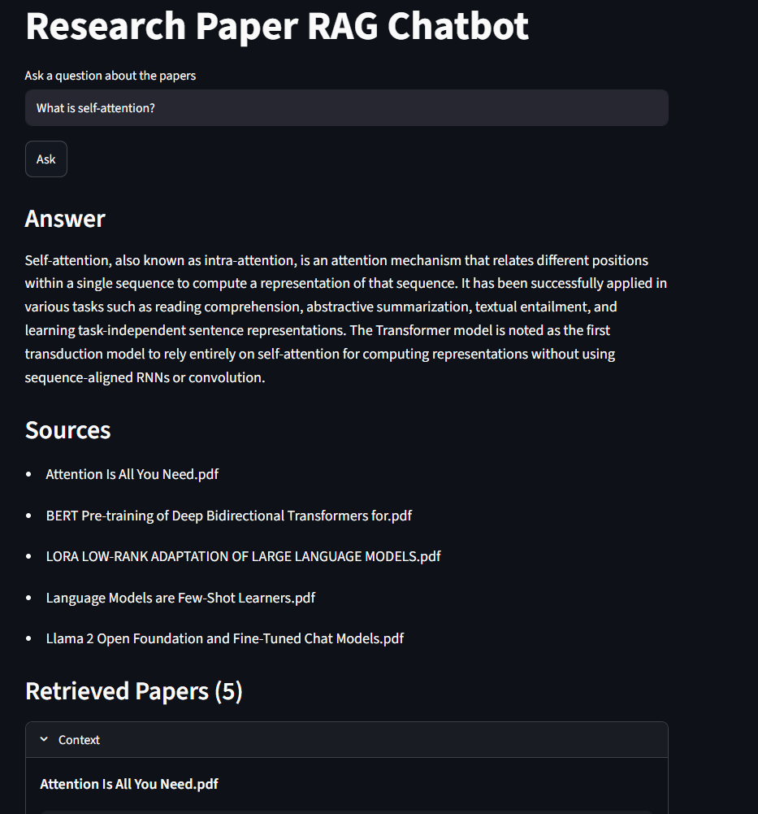
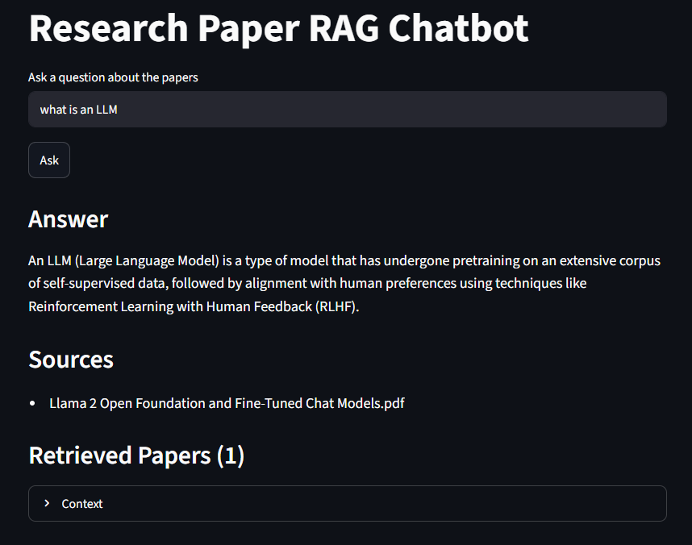
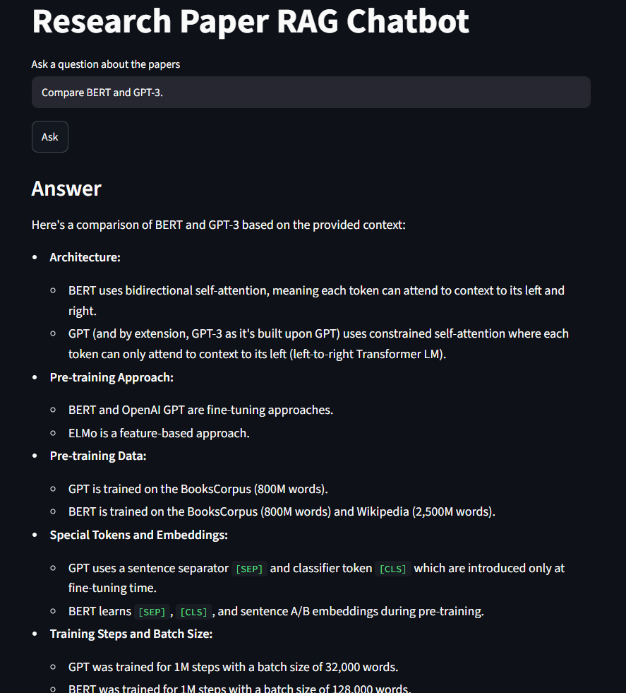
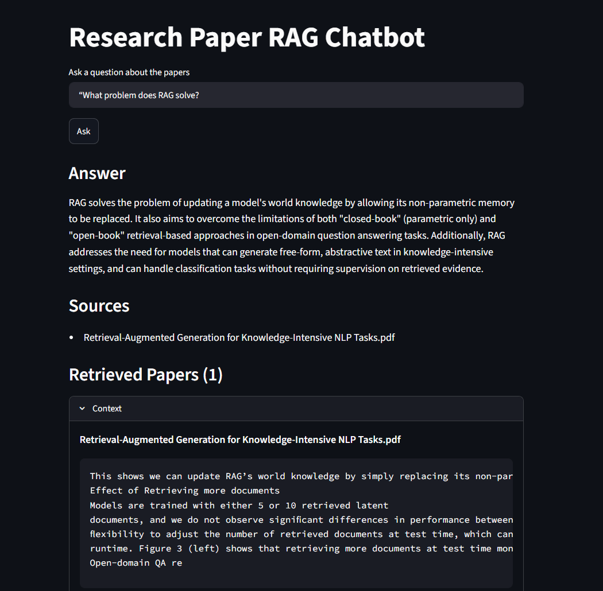

# Research Paper RAG Chatbot

## Overview

This project implements a Retrieval-Augmented Generation (RAG) chatbot capable of answering questions from a collection of research papers.

The system extracts text from research papers, converts the content into vector embeddings, stores them in a FAISS vector database, retrieves the most relevant chunks for a user query, and uses Google's Gemini FLASH model to generate answers grounded in the retrieved context.

The chatbot is deployed using Streamlit and provides source citation along with retrieved document chunks for transparency.

---

## Features

* PDF ingestion using PyMuPDF(Fitz)
* Automatic text chunking
* Semantic embeddings using Sentence Transformers
* Vector search using FAISS (also known as Facebook AI Similarity Search)
* Question answering using Gemini Flash Model
* Source paper citation
* Retrieved chunk/context visualization
* Streamlit-based user interface
* Hallucination reduction through accurate prompts

---

## System Architecture

Research Papers (PDFs)
        ↓
Fitz(PyMuPDF) Text Extraction
        ↓
Chunking (1000 characters, 200 overlap)
        ↓
Sentence Transformer Embeddings
        ↓
FAISS Vector Store
        ↓
Similarity Search
        ↓
Gemini 2.5 Flash Lite
        ↓
Answer + Sources + Retrieved Chunks

---

## TechStack Used

### Backend

* Python
* LangChain
* FAISS
* Sentence Transformers
* Google Gemini API

### Frontend

* Streamlit

### PDF Processing

* PyMuPDF (Fitz)

---

## Project Structure

```text
applied_ml_domain/
│
├── papers/
│   ├── paper1.pdf
│   ├── paper2.pdf
│   └── ...
│
├── Screenshots
│
├── vectorstore/
│
├── build_vectorstore.py
├── rag.py
├── app.py
│
├── .env
├── requirements.txt
└── README.md
```

## How It Works

### 1. PDF Extraction

All PDFs inside the papers directory are loaded using PyMuPDF.
Text from every page is extracted and combined into a single document.

### 2. Chunking

Documents are split into chunks using RecursiveCharacterTextSplitter.
Parameters used:
* Chunk Size: 1000
* Chunk Overlap: 200
Chunk overlap helps preserve context between neighboring chunks.

### 3. Embedding Generation

Each chunk is converted into a vector representation using:
```text
sentence-transformers/all-MiniLM-L6-v2
```

### 4. Vector Database
The embeddings are stored inside a FAISS vector database for efficient similarity search.

### 5. Retrieval
For every user question:

* The question is embedded.
* Similarity search is performed on FAISS.
* Top-k nearest neighbouring relevant chunks are retrieved.

### 6. Generation

The retrieved chunks are provided to Gemini along with a prompt instructing it to:

* Use only the provided context.
* Avoid hallucinations.
* Mention source papers when relevant.
* State when information is unavailable.

---

## Example Questions

### What is self-attention?

<p align="center">
  
</p>

### What is an LLM?

<p align="center">
  
</p>

### What is BERT?

<p align="center">
  
</p>

### What problem does RAG solve?

<p align="center">
  
</p>

---

## Experiments and Observations

While building the RAG pipeline, I experimented with different retrieval settings to understand how they affect answer quality and source diversity.

### Experiment 1: Effect of Retrieval Depth (k)

The most important retrieval parameter in this project is **k**, which determines how many chunks are retrieved from the vector database before sending the context to the language model.

I tested three different values:

#### k = 5

With k set to 5, only the five most similar chunks were retrieved.

**Observations:**

* Retrieval was fast and focused.
* Answers were generally concise and relevant.
* However, comparison-based questions often missed information from other papers.
* The chatbot sometimes cited only one or two papers even when multiple papers contained useful information.

For example, questions such as *"Compare BERT and GPT-3"* often retrieved chunks from only one paper, resulting in incomplete answers.

---

#### k = 10

I then increased the retrieval depth to 10.

**Observations:**

* More papers appeared in the retrieved results.
* Comparison questions became noticeably better.
* The chatbot was able to combine information from multiple sources more effectively.
* The increase in context size did not significantly affect response quality.

This setting provided a good balance between retrieval quality and context relevance.

---

#### k = 20

Finally, I experimented with retrieving 20 chunks.

**Observations:**

* Source diversity increased further.
* Questions involving multiple models or concepts retrieved information from more papers.
* However, additional noise began to appear.
* Some retrieved chunks came from reference sections, citations, or less relevant parts of papers.

While k = 20 improved coverage, it occasionally reduced precision because irrelevant chunks were included in the context.

---

### Final Choice

After testing multiple values, I selected:

```python
k = 20
```


### Retrieval Quality Analysis

During testing, I observed that retrieval quality has a direct impact on answer quality.

When the correct chunks were retrieved, Gemini produced accurate and grounded responses. However, when retrieval missed important information, the generated answer was naturally incomplete.

This observation reinforced a key principle of Retrieval-Augmented Generation systems:

 A strong language model cannot compensate for missing or poorly retrieved context.

Because of this, improving retrieval often had a larger effect on answer quality than modifying the prompt itself.

---

### Source Attribution/Citation

To improve transparency, metadata from every chunk was stored during vector database creation.

This allowed the chatbot to display:

* Source paper names
* Retrieved chunks
* Evidence used to generate answers

As a result, users can verify where information originated rather than relying solely on the generated response.

---

### Example Observation

For the question:

> Compare the evolution of Transformer-based language models from the original Transformer to BERT, GPT-3, and Llama 2.

Using a higher retrieval depth enabled the system to retrieve information from multiple papers, including:

* Attention Is All You Need
* BERT: Pre-training of Deep Bidirectional Transformers
* Language Models are Few-Shot Learners
* Llama 2 Open Foundation and Fine-Tuned Chat Models

This produced a more complete answer than lower retrieval settings, where only one or two papers were retrieved.


---

## Limitations

Although the chatbot performs well for most questions, there are still several limitations.

* The system currently focuses only on text extraction. Figures, diagrams, and images present in research papers are ignored during processing.
* Tables are extracted as plain text, which can sometimes make structured information difficult to interpret correctly.
* Some retrieved chunks may come from bibliography or reference sections instead of the main content of a paper.
* The quality of the final answer is highly dependent on the quality of the retrieved chunks. If important information is not retrieved, the generated response may be incomplete.
* The application relies on the Gemini API, so usage is constrained by API quotas and rate limits.

---

## Future Improvements

Given more time, several enhancements could be made to improve the system.
* Add a reranking stage to reorder retrieved chunks based on relevance before sending them to the language model.
* Support figure and table retrieval so that non-text information can also be used when answering questions.
* Add conversational memory, allowing users to ask follow-up questions without repeating previous context.

These improvements would make the chatbot more accurate, robust, and useful for exploring large collections of research papers.


## Running the Project

### Install Dependencies

```bash
pip install -r requirements.txt
```

### Create Environment File

```text
GEMINI_API_KEY=YOUR_API_KEY_HERE
```

### Build Vector Database

```bash
python applied_ml_domain/build_vectorstore.py
```

### Launch Chatbot

```bash
streamlit run applied_ml_domain/app.py```

## Author

Akshat Goyal

Developed as part of the Spider Machine Learning Task.
